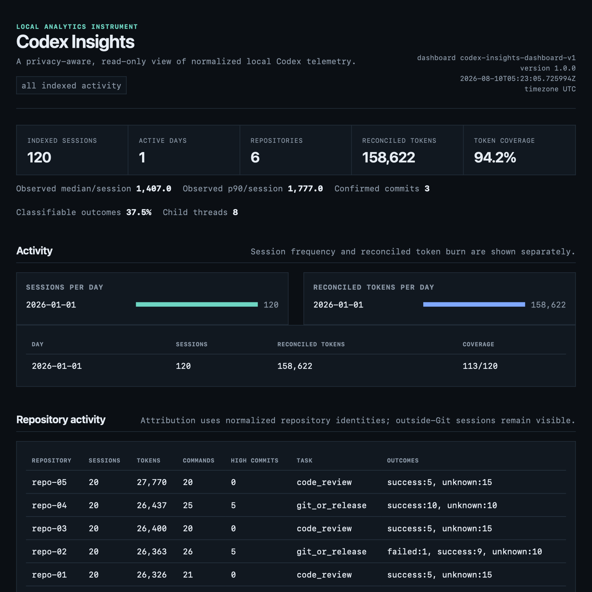

# Codex Insights

Codex Insights is a local-first, read-only analytics workbench for Codex sessions. It turns
undocumented local session state into a separate normalized SQLite index, then answers practical
questions about activity, token usage, repositories, models, prompts, tools, Git provenance,
outcomes, and task patterns without uploading a working history.

Version 1.0 is a local release candidate. It provides the complete command-line workflow, offline
reports and dashboard, explicit privacy controls, forward-compatible source diagnostics, synthetic
integration coverage, and guarded derived-data maintenance. It is not yet a publicly published
release.



The screenshot above was generated from the repository's deterministic synthetic corpus. It does
not contain data from a real Codex installation.

## What it does

- discovers and audits local Codex storage with bounded, metadata-only reads;
- incrementally indexes normalized sessions into a separate application database;
- reconciles defensibly identified inherited token and event replay across child threads;
- explores sessions, repositories, models, prompts, tools, commands, commits, outcomes, and tasks;
- generates Markdown, JSON, and self-contained offline HTML reports;
- generates a static offline dashboard with no server, JavaScript, CDN, analytics, or tracking;
- exposes source capability, metric coverage, confidence, ambiguity, and stale-state diagnostics;
- controls future prompt/command-text retention and safely exports, backs up, purges, or resets only
  derived Codex Insights state.

Codex Insights never claims that activity volume is productivity or that a heuristic outcome is a
ground-truth result.

## Local-first safety and privacy

The configured Codex home is immutable source data. Codex Insights never writes, renames, moves,
deletes, vacuums, migrates, or modifies files or databases under it. Source SQLite databases are
opened read-only with query-only mode. The derived index is rejected if its resolved path overlaps
the source home.

Raw rollout histories can contain prompts, source excerpts, commands, paths, tool output, patches,
environment details, and other private material. Feeding an entire rollout collection back into an
agent creates unnecessary disclosure and a second copy in model context. Codex Insights instead
uses bounded streaming parsers and stores only normalized metadata, aggregate evidence, redacted
and capped user prompts when enabled, and redacted and capped command text when enabled.

It never persists raw tool stdout/stderr, raw rollout lines, patches, environment dumps, assistant
hidden reasoning, or arbitrary transcript content. Redaction reduces risk but cannot recognize
every sensitive datum; protect the local index, reports, exports, and backups like other local
development data. See [data safety](docs/data-safety.md) and [privacy](docs/privacy.md).

## Install

Python 3.11 or newer is required. From a checkout:

```bash
git clone https://github.com/angzeli/codex-insights.git
cd codex-insights
python3 -m venv venv-acceptance
source venv-acceptance/bin/activate
python -m pip install .
codex-insights version
```

Codex home discovery uses this precedence:

1. `--codex-home PATH`
2. `CODEX_HOME`
3. `~/.codex`

The default derived database is outside the Codex home:

- macOS: `~/Library/Application Support/Codex Insights/index.sqlite3`
- Windows: `%LOCALAPPDATA%\Codex Insights\index.sqlite3`
- Linux/other: `${XDG_DATA_HOME:-~/.local/share}/codex-insights/index.sqlite3`

Use `--db PATH` for another safe location.

## Five-minute quick start

```bash
# 1. Confirm runtime and detected paths without reading histories.
codex-insights doctor

# 2. Inspect source layout and schemas with a bounded metadata-only sample.
codex-insights audit-source

# 3. Build or incrementally refresh the separate normalized index.
codex-insights index

# 4. Review coverage and activity.
codex-insights stats
codex-insights usage --since 7d --by repo

# 5. Generate an offline dashboard and open it explicitly.
codex-insights dashboard --since 30d --open
```

`doctor --deep` adds read-only parser/schema selection, capability coverage, stale-session, source
drift, lineage, and derived-index integrity diagnostics. `audit-source` streams only a small sample
of rollout files and reports field shapes and text lengths, never prompt bodies or raw tool output.

## Common workflows

Explore normalized history:

```bash
codex-insights sessions --since 7d --active --limit 25
codex-insights session SESSION_ID_PREFIX --commits
codex-insights repos
codex-insights models
codex-insights stats --json
```

Analyze reconciled usage and provenance:

```bash
codex-insights usage --reconciliation
codex-insights usage --since 30d --by model --top 10
codex-insights usage --by day --timezone Asia/Shanghai
codex-insights provenance
```

Inspect local content and activity:

```bash
codex-insights prompts --since 7d
codex-insights search '"quoted phrase"' --repo codex-insights
codex-insights prompt PROMPT_ID_PREFIX
codex-insights tools --since 7d
codex-insights commands --repeated
```

Review higher-level evidence:

```bash
codex-insights commits --confidence high
codex-insights commit COMMIT_PREFIX
codex-insights outcomes --since 30d
codex-insights tasks --by type
codex-insights tasks --by domain
```

`--since` is inclusive. Timestamp `--until` values are exclusive; a date-only `--until` includes
that complete calendar day. Commands that group by local calendar time accept `--timezone`; stored
timestamps remain timezone-aware UTC. JSON uses `null` for unavailable values rather than silently
turning them into zero.

## Reports and dashboard

```bash
codex-insights report weekly --timezone local
codex-insights report monthly --format json --output monthly.json
codex-insights report weekly --format html --output weekly.html

codex-insights dashboard --since 30d --output dashboard.html
codex-insights dashboard --repo codex-insights --task implementation --open
```

Reports and dashboards reuse the same analytics layer as the CLI. Filters are applied while the
artifact is generated; HTML contains bounded aggregate data, escaped user-controlled labels, and no
remote assets or embedded prompt/command bodies. File output is explicit and rejects the Codex
home, the derived database, protected configuration, symlink aliases, and existing source inodes.
See [reports](docs/reports.md) and [dashboard](docs/dashboard.md).

Synthetic CLI example:

```text
$ codex-insights usage --by repo --timezone UTC
150 reconciled tokens across 2/4 sessions with token records (50.0%)

Repository                Sessions  Reconciled tokens  Token data
repo-one                         2                100         1/2
Outside Git repositories        1                 50         1/1
repo-two                         1            unknown         0/1
```

## Metric semantics

The central distinction is between what physically appears in a rollout and what the local
evidence model can attribute to that thread:

- a session detail shows its observed final cumulative rollout usage;
- additive totals use reconciled local contributions, subtracting only exact inherited/replayed
  ancestor baselines;
- daily and weekly token totals use nonnegative cumulative increments at token-event time, so one
  resumed logical session can contribute on multiple dates without changing its all-time total;
- mean, median, and p90 tokens/session describe observed per-rollout values;
- prompts and tool/command totals use origin-aware logical/originated events;
- Git associations retain HIGH, MEDIUM, LOW, and ambiguous evidence separately;
- outcomes and tasks are deterministic, versioned heuristics with UNKNOWN retained.

Ambiguous lineage is not guessed away. Missing values remain unknown, coverage denominators are
shown, and child-exclusive contributions stay attributed to the child's repository and model at
token-event time. Missing or inconsistent event timing is reported as temporally unattributed, not
silently assigned to the session start date. Local Codex token telemetry is not guaranteed to equal OpenAI server-side quota,
billing, or UI accounting. Full definitions are frozen in [metrics](docs/metrics.md).

## Architecture

```text
Codex source files and read-only state databases
  -> CodexLocalAdapter (unstable source-format boundary)
  -> normalized source-independent models
  -> separate versioned Codex Insights SQLite index
  -> shared analytics/query layer
  -> CLI, exports, reports, and static dashboard
```

The adapter is the only layer that understands undocumented Codex-local schemas. Core analytics do
not depend on a particular `state_*.sqlite`, table name, rollout path depth, or event spelling. The
index is rebuildable derived state and its migrations never target Codex-owned databases. See
[architecture](docs/architecture.md) and [database schema](docs/database-schema.md).

## Source compatibility

Codex local storage is undocumented and may change without notice. Codex Insights selects source
databases by compatible structure and rollout-reference consistency, records parser/schema
versions, counts unknown record shapes without storing payloads, and models capabilities as
`available`, `degraded`, `not_observed`, or `unknown`. A live partial write or failed reparse keeps
the last trustworthy normalized session and marks it stale instead of replacing it with incomplete
data. Use `doctor --deep` after a Codex update. See [source compatibility](docs/schema-compatibility.md)
and [observed source formats](docs/source-format.md).

## Privacy controls, export, backup, and reset

```bash
codex-insights privacy inspect --json
codex-insights privacy config --store-prompts off --store-command-text off
codex-insights privacy purge prompts
codex-insights privacy purge command-text

codex-insights export --dataset usage --format json --output usage.json
codex-insights export --dataset sessions --format csv --output sessions.csv
codex-insights backup-index /safe/path/index-backup.sqlite3
codex-insights reset-index --backup /safe/path/before-reset.sqlite3
```

Exports are stable `codex-insights-export-v1` JSON or spreadsheet-safe CSV. They obey the active
retention policy, use explicit `observed_rollout_*` and `reconciled_local_*` names, and escape
formula-like CSV cells. Purge clears prompt rows and FTS content or nulls retained command text;
backup uses SQLite's consistency API and reports retained text counts; reset verifies the expected
Insights schema before deleting only the derived database and sidecars.

## Development, testing, and benchmarks

```bash
./scripts/setup-dev.sh
source venv-acceptance/bin/activate

python -m pytest
python -m ruff check .
python -m mypy src
python -m build
```

The setup helper uses a non-hidden environment name and verifies the prior macOS editable-install
failure mode where Python can skip an editable `.pth` marked `UF_HIDDEN`. It checks and repairs only
the verified Codex Insights artifact inside the active isolated environment.

CI is configured for Python 3.11, 3.12, 3.13, and 3.14, Ruff, mypy, wheel/sdist installation, Linux
CLI smoke tests, and macOS normal/editable-install smoke tests. Tests use committed fixtures or
temporary deterministic synthetic corpora; they never read a developer's real Codex history.

The 10,000-session synthetic benchmark covers fresh, unchanged, and one-session-changed indexing,
common analytics, reports, dashboard generation, memory, and database size. Run it manually:

```bash
python scripts/benchmark.py --sessions 10000 --output /tmp/codex-benchmark.json
```

One reference run on Python 3.14/macOS completed fresh indexing in 47.5 s, unchanged and one-session
updates in about 5.0 s, the slowest common query in 0.22 s, report/dashboard generation in 4.7/5.0
s, with 262 MiB peak process memory and a 119.6 MiB derived database. Timings are diagnostics, not
portable performance guarantees.

See [testing](docs/testing.md) and [benchmarks](docs/benchmarks.md). The optional
`scripts/real_local_smoke.py` is developer-only, aggregate-only, explicitly confirmed, and never
used by tests or CI.

## Known limitations

- Codex local storage is undocumented; source capabilities vary across Codex versions.
- Some child-thread lineage remains ambiguous and is intentionally not deduplicated by guesswork.
- Local token telemetry may differ from OpenAI server-side billing, quota, or UI accounting.
- Git correlation is deliberately conservative; only exact originated evidence is HIGH confidence.
- Outcome classification and task taxonomy are versioned heuristics, not semantic or causal truth;
  UNKNOWN and LOW-confidence results are expected.
- Redaction is bounded pattern recognition, not a substitute for encryption or access control.
- Prompt search covers retained, redacted, origin-aware user prompts only; disabled or purged text
  cannot be reconstructed.
- The dashboard is generated static HTML rather than a continuously updating server.
- CI is configured but remote CI status is only meaningful after commits are pushed and workflows
  run; a local checkout cannot claim remote validation.

## Roadmap

Post-v1 work may improve source-version adapters, provenance evidence, configurable taxonomy rules,
and longitudinal efficiency diagnostics. LLM transcript analysis, causal productivity scoring, and
automatic upload are intentionally outside the current product.

## License

[MIT](LICENSE)
