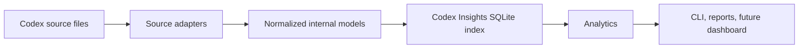

# Architecture

## Goals

Codex Insights will provide local analytics over Codex activity while treating the user's Codex
state as an immutable external source. The foundation favors a small Python surface area, explicit
boundaries, and replaceable format-specific code.

## Conceptual pipeline

1. **Codex source files** remain owned by Codex and are opened only for bounded, read-only
   inspection.
2. **Source adapters** understand a particular observed storage format and translate it without
   leaking format assumptions downstream.
3. **Normalized internal models** represent stable metadata such as time, project, model, token
   counts, aggregate tool usage, and cautiously inferred outcomes.
4. **Codex Insights SQLite index** is a derived, rebuildable database stored outside Codex home.
5. **Analytics** answer product questions from normalized local data rather than raw rollouts.
6. **Interfaces** expose results through the CLI and reports first, with a dashboard only when its
   requirements are clear.

## Source-adapter boundary

Codex local storage is not a public, stable API. File names, record shapes, SQLite schemas, and
relationships may change. Each adapter must therefore:

- declare which source shape it recognizes;
- use bounded discovery instead of recursive bulk reads;
- open source SQLite databases with read-only access;
- convert records into internal models;
- fail closed on unknown or ambiguous formats;
- avoid returning raw command output, tool stdout/stderr, or unrelated content.

The rest of the application must not import source-format-specific schemas. A future adapter can
replace `CodexLocalAdapter` without changing analytics or presentation code.

## Package responsibilities

- `config.py`: path precedence and analyzer defaults.
- `discovery.py`: bounded metadata-only environment checks.
- `models.py`: normalized, source-independent records.
- `lineage.py`: exact-vector thread topology and token-lineage evidence rules.
- `adapters/`: contracts and format-specific read-only source access.
- `db.py`: source read-only connections and the separate derived index.
- `indexer.py`: source-independent incrementality, transactional upserts, and run accounting.
- `analytics/`: reusable read-only queries and future classifications over normalized data.
- `cli.py`: user-facing commands and reports.
- `history_cli.py`: compact terminal and JSON presentation for normalized history queries.
- `analytics/usage.py`: token-coverage-aware grouping, percentiles, and timezone bucketing.
- `usage_cli.py`: compact usage tables and structured JSON output.

## Index lifecycle

The analyzer index is derived state, never the source of truth. It should be safe to discard and
rebuild. Schema migrations apply only to this separate index. They must never target Codex-owned
databases. Provenance should eventually record adapter version and source identity without copying
sensitive raw content.

The initial indexer asks an adapter for normalized catalogue candidates and parses only candidates
whose rollout size, nanosecond mtime, parser version, or recognized source-schema version changed.
Each session is committed independently, so one failed rollout does not roll back successful
sessions. The run log records discovered, new, updated, unchanged, skipped, and failed counts.

History exploration starts at the separate index. `analytics/queries.py` owns filtering, prefix
resolution, deterministic ordering, aggregation, time-boundary semantics, and missing-data
handling. It does not import the Codex-local adapter. `history_cli.py` converts those typed results
to compact Rich tables or JSON and avoids absolute paths in ordinary session lists.

Usage analytics follows the same boundary. It consumes observed usage plus normalized explicit
thread relationships, preserves null fields as missing data, and uses lineage-adjusted incremental
contributions only when exact vector evidence supports them. Repository/model and time attribution
stay with the contributing child session. Presentation code receives typed results and never opens
rollout files or Codex-owned databases.

## Planned capability stages

1. Bounded inventory and explicit source-version detection.
2. Minimal session metadata normalization and incremental indexing.
3. Aggregate project, model, token, and tool analytics.
4. Git commit correlation using repository metadata.
5. Conservative outcome and rework heuristics with explainable evidence.
6. CLI reports, export controls, and an optional local dashboard.

Each stage must preserve the data-safety invariants in `docs/data-safety.md`.
