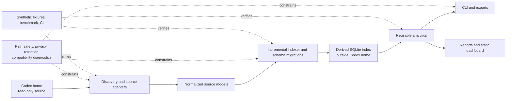

# Codex Insights v1.1 forensic refinement audit

**Audit date:** 2026-08-12
**Audit branch:** `audit/v1.1-forensic`
**Frozen baseline:** `v1.0.0` at `163d54c359743bc98def1ac056f61d643f8d1e55`
**Purpose:** rank evidence-backed work for a future v1.1 without changing v1.0 behavior

## 1. Executive summary

Codex Insights v1.0.0 remains a coherent, publicly released baseline. The release tag, public
release, `origin/main`, package version, schema version, parser version, and latest remote CI all
agree. The audit found no reason to rewrite the architecture or weaken its deliberately conservative
analytics.

The most important findings are narrower:

1. `reset-index` has a reproducible time-of-check/time-of-use gap: a file can be replaced after
   schema validation but before path-based deletion. This is a local derived-data safety blocker.
2. command executable inference treats a shell string as one `shlex` token stream. It therefore
   records control words, wrapper options, builtins, and subshell fragments as executables. This is
   confirmed wrong analytics, not cosmetic output.
3. the undocumented structured thread `source` value is retained as raw JSON-like text in
   `client_source`, crossing the source-adapter boundary and suppressing prompt authorship for most
   indexed subagent/guardian sessions. It needs a normalized source-kind model, not more taxonomy
   regular expressions.
4. 202 of 258 indexed outcomes are LOW-confidence `success`, primarily because a nearly universal
   lifecycle `task_complete` signal is treated as task success when any supporting activity exists.
   The current confidence label is honest, but the aggregate “classifiable” headline is too broad.
5. unchanged 10,000-session indexing still spends about 4.9 seconds on global discovery and
   derived reconciliation. A one-session change costs about the same because repositories, Git,
   outcomes, prompt features, taxonomy, and coverage are globally recomputed.

The findings count is **2 S, 6 A, 6 B, and 1 C**. The recommended first three implementation tasks
are: close the reset identity race, replace executable inference with a bounded shell-head parser,
and normalize structured client-source metadata behind the adapter boundary. None is implemented
by this audit.

## 2. v1.0 baseline reviewed

| Item | Audited state |
| --- | --- |
| Starting `main` / `origin/main` | `163d54c359743bc98def1ac056f61d643f8d1e55`; ahead/behind `0/0` |
| `v1.0.0` | Annotated tag peels to the same commit |
| Public release | Published, non-draft, non-prerelease GitHub Release |
| Package version | `1.0.0` |
| Derived schema | `16` |
| Source parser | `codex-source-parser-v8` |
| Latest remote CI | Run `31466542595`, successful on the release commit |
| CI test baseline | 192 tests passed on Python 3.11, 3.12, 3.13, and 3.14 |
| Other CI gates | Ruff, mypy, wheel/sdist build and fresh install, macOS normal/editable install passed |
| Existing 10k reference | Fresh 47.5 s; unchanged/about-one-change about 5.0 s; 119.6 MiB DB |
| Repository size | 55 source modules / 21,430 lines; 33 test modules / 6,794 lines |

The audit relied on the exact current remote CI and release evidence rather than rerunning the full
release acceptance suite. The existing acceptance report remains the v1.0 release record. Targeted
synthetic experiments and read-only aggregate queries were used only where the release evidence did
not answer a forensic question.

The current local source has advanced beyond the last derived snapshot:

| Aggregate | Current source | Last derived index |
| --- | ---: | ---: |
| Threads/sessions | 280 | 258 |
| Explicit spawn edges | 30 | 29 |
| Valid rollout references | 280 | 258 indexed rollouts |
| Missing source rollout references | 0 | 0 recorded parse failures |

The derived snapshot completed on 2026-08-11 and is 22 source sessions behind. It was intentionally
not refreshed during this read-only audit. All derived-index findings below therefore describe the
258-session snapshot unless explicitly labelled as current-source evidence.

## 3. Architecture map

| Layer | Public surface | Source of truth and invariant | Main dependencies / hotspot |
| --- | --- | --- | --- |
| CLI | Typer commands in `cli.py` and focused `*_cli.py` modules | Human and JSON output must preserve unknown/coverage semantics | `cli.py` remains a broad command registry; output schemas vary by command |
| Configuration | `config.py`, retention configuration | Codex home precedence and platform-aware derived paths; no overlap | Path validation is reused well |
| Discovery | `discovery.py`, `adapters/codex_audit.py` | Bounded metadata discovery; no recursive transcript dump | Undocumented source layout |
| Source adaptation | `adapters/codex_local.py`, `codex_index.py`, `codex_events.py` | Read-only SQLite/streaming JSONL; source details stop here | `codex_index.py` is 1,395 lines and currently leaks structured `client_source` text |
| Normalized models | `models.py` | Stable, content-bounded dataclasses and explicit capability states | Some source-origin semantics remain represented as free text |
| Schema/migrations | `db.py` | Versioned transactional derived schema; source DB never migrated | 16 migrations in a 991-line module; tests cover rollback and historical migration |
| Indexing | `indexer.py` | Idempotent per-session upsert; one malformed session does not abort all | 2,859 lines; coordinates lineage, provenance, prompts, repositories, coverage |
| Token lineage/time | `token_lineage.py`, `analytics/usage.py` | Observed rollout totals remain distinct from reconciled additive contributions | Conservative ambiguity retention is correct and should remain |
| Event provenance | `event_provenance.py`, indexer reconciliation | Originated events are distinct from inherited/replayed observations | Topology changes correctly bound event reconciliation |
| Prompts / FTS | privacy, prompt index/features/search modules | Only redacted, originated logical prompts; purge reaches FTS shadow state | Source-authorship decision depends on raw `client_source` shape |
| Tools/commands | `command_normalization.py`, `analytics/tools.py` | Only bounded/redacted command metadata; aggregate originated activity | Executable inference is not shell-grammar aware; analytics aggregate rows in Python |
| Git | `git_correlation.py`, Git analytics/CLI | HIGH requires explicit originated evidence; time alone remains LOW | Broad candidate windows and current-checkout branch evidence |
| Outcomes/tasks | `outcomes.py`, `taxonomy.py` | Deterministic, explainable evidence; UNKNOWN retained | Whole-table per-session reconciliation and weak lifecycle success evidence |
| Reports/dashboard | analytics builders plus `reporting.py`, `dashboard_rendering.py` | Shared metric semantics, offline escaped output, no JS/network | Repeated analytics calls and per-repository task queries |
| Privacy/maintenance/export | `privacy.py`, `path_safety.py`, `maintenance.py`, `exporting.py` | Derived-only writes, redaction, CSV/HTML safety, guarded backup/reset | Confirmed reset identity race between validation and unlink |
| Diagnostics/compatibility | `diagnostics.py`, compatibility tables/tests | Previous-good state survives partial or drifting source input | Aggregate unknown count is noisy; human deep-doctor omits useful JSON evidence |
| Test/release tooling | `tests/`, `scripts/`, `.github/workflows/ci.yml` | Synthetic-only tests and multi-version packaging gates | Windows is documented but not exercised; benchmark imports POSIX `resource` |

The stable dependency direction is sound. The main maintenance risk is orchestration density, not a
need for a new framework: `indexer.py`, `codex_index.py`, and the duplicated report/dashboard query
assembly are the high-leverage boundaries for future extraction.

## 4. Forensic methodology

The audit used four evidence classes:

- static tracing of adapters, normalized models, schema/migrations, reconcilers, analytics, CLI,
  rendering, path safety, tests, scripts, CI, and release documentation;
- structural code-graph queries to identify central modules and source-format knowledge leakage;
- deterministic synthetic probes outside the repository for shell parsing, reset replacement races,
  1k/5k/10k profiling, query plans, and generated report/dashboard behavior;
- bounded aggregate-only reads of the configured Codex source and derived index. Source SQLite was
  opened read-only; the derived index was opened with `mode=ro` and `PRAGMA query_only=ON`.

No raw prompt body, full command body, tool output, hidden reasoning, rollout line, session ID,
repository name, agent name, or private absolute path is included here. No source or derived index
was changed. Synthetic profiling helpers and generated HTML stayed outside the repository.

## 5. Findings summary

The optional scores are ordinal planning aids, not measurements. Risk means implementation/semantic
risk, where 5 is highest.

| ID | Priority | Finding | Impact | Confidence | Risk | Scope | Disposition |
| --- | :---: | --- | :---: | :---: | :---: | :---: | --- |
| SEC-001 | S | Reset validates one file identity and later unlinks whatever occupies the path | — | — | — | S | v1.0.x or first v1.1 |
| CMD-001 | S | Shell control/wrapper tokens are persisted as executables | — | — | — | M | First v1.1 correctness work |
| SRC-001 | A | Structured thread source text crosses the adapter boundary unnormalized | 4 | 5 | 3 | M | Early v1.1 |
| OUT-001 | A | LOW lifecycle evidence dominates `success` and classifiable outcomes | 5 | 5 | 4 | M | Early v1.1 |
| IDX-001 | A | Unchanged indexing reruns global derived reconciliation | 4 | 5 | 3 | L | v1.1 after correctness |
| DIA-001 | A | Unknown-source headline mixes ignored fields with semantic gaps | 4 | 5 | 2 | M | v1.1 diagnostics |
| GIT-001 | A | LOW candidates explode and historical evidence depends on current branch | 4 | 5 | 4 | L | v1.1 evidence model |
| SQL-001 | A | Global time queries and report/dashboard orchestration repeat scans | 4 | 5 | 3 | M | v1.1 performance |
| TAX-001 | B | UNKNOWN reporting hides that missing origin intent is the main cause | 3 | 5 | 2 | S | v1.1 presentation |
| DOC-001 | B | Human `doctor --deep` omits source/index lag and key reconciliation diagnostics | 3 | 5 | 1 | S | v1.1 diagnostics |
| UI-001 | B | Hidden radios lack visible keyboard focus; light-theme contrast and table names need work | 3 | 5 | 2 | M | v1.1 UX |
| REL-001 | B | README and changelog still describe pre-release state | 2 | 5 | 1 | XS | Next documentation patch |
| CI-001 | B | Documented Windows paths lack CI; benchmark imports POSIX-only `resource` | 2 | 5 | 2 | S | Conditional v1.1 |
| MNT-001 | B | Oversized orchestration modules and report/dashboard duplication raise change risk | 3 | 4 | 4 | XL | Stage, do not wholesale-refactor |
| CLI-001 | C | Machine-readable support is inconsistent on operational commands | — | — | — | S | Optional, preserve schemas |

## 6. S findings

### SEC-001 — Reset has a file-identity TOCTOU gap

**Priority:** S
**Area:** Privacy and local security / derived-data maintenance
**Estimated scope:** S

**Evidence.** `maintenance.validate_expected_index()` resolves the path, verifies a regular file,
opens it read-only, and confirms the minimum Insights schema. It then closes the connection and
returns only the path and schema version. `maintenance.reset_index()` later revalidates path safety
and calls `unlink()` by pathname. A controlled temporary-directory probe replaced the validated
synthetic database with an unrelated synthetic file at that boundary. Reset returned success and
deleted the replacement: one file removed, neither the path nor replacement remained. No real
database or source was involved.

**Current behavior.** The schema check proves what occupied the pathname at validation time, not
what is deleted later. The same path-only pattern is used for SQLite sidecars.

**Why it matters.** A concurrent local process, symlink/hard-link swap, or accidental replacement
can cause a command explicitly advertised as guarded to delete a non-Insights file. The target is
derived state rather than Codex source, but unintended file deletion is still a safety blocker.

**Root cause.** Identity evidence (device/inode and file type) is not carried across the validation
and destructive operation, and the final unlink is not coupled to an open/verified directory entry.

**Recommended refinement.** Capture `lstat` identity when validating; immediately before each
delete, re-`lstat` and reject changed device, inode, type, or link state. Prefer directory-file-
descriptor/no-follow operations where portable. Treat `-wal` and `-shm` as optional sidecars bound
to the same verified base database, not merely matching names. Review backup overwrite/replace for
the same race class without broadening this fix unnecessarily.

**Risks.** Overly strict identity checks can reject legitimate WAL lifecycle changes or reduce
portability. Never weaken Codex-home overlap/inode protections to make the check pass.

**Validation strategy.** Add a deterministic swap-at-boundary regression, symlink/hard-link and
non-regular-file negatives, valid base+sidecar deletion, backup-then-reset, and platform-aware tests.
Assert the replacement remains intact and reset fails closed.

### CMD-001 — Executable normalization is not shell-aware

**Priority:** S
**Area:** Command normalization / analytics correctness
**Estimated scope:** M

**Evidence.** `normalize_command()` redacts and truncates text, `_tokens()` applies `shlex.split()`,
and `_command_index()` skips assignment-shaped tokens and exact wrapper names before `_executable()`
takes a basename. It does not parse control operators, compound commands, shell keywords, wrapper
options, subshells, or pipelines. Synthetic results include:

| Structural input | Current executable | Defect |
| --- | --- | --- |
| loop beginning with `for` | `for` | shell keyword |
| conditional beginning with `if` | `if` | shell keyword |
| loop beginning with `while` | `while` | shell keyword |
| `sudo` with user option before a command | `-u` | wrapper option |
| `command -v ...` | `-v` | wrapper option / builtin operation |
| `time -p ...` | `-p` | wrapper option |
| `env -i` plus assignment and command | `env` | wrapper option handling stops early |
| `cd ... && command` | `cd` | first segment builtin, later executable ignored |
| parenthesized `cd ... && command` | `(cd` | subshell punctuation retained |
| leading assignment plus command | expected command | supported case |
| `python -m pytest` | `python` / testing | supported case |

The 258-session derived snapshot contains 34,244 originated commands. A conservative definitely
invalid floor is 209 (0.61%): `for` 115, `-v` 58, `-f` 18, `if` 16, and `while` 2. Including `cd`
as a non-external command-head artifact gives 456 (1.33%); including three ambiguous `time` rows
gives 459 (1.34%). The remaining 98.66% is not automatically proven trustworthy; it simply does
not match this bounded suspicious set.

**Current behavior.** The stored value is surfaced directly in tool, command, report, dashboard,
and repeated-command aggregates. Categories derived from it can also be wrong.

**Why it matters.** This is a measured error in a core analytics dimension. It distorts executable
rankings, command categories, testing counts, and any future efficiency analysis built on command
identity.

**Root cause.** Shell lexical tokenization is being used as command-structure parsing, while the
field name promises an executable rather than merely the first whitespace-like token.

**Recommended refinement.** Implement a small deterministic shell-head parser, not a shell
evaluator: split control segments outside quotes; handle leading assignments; recognize supported
wrappers and their option arity; reject control keywords; distinguish builtins from external
executables; represent unsupported or ambiguous shapes explicitly. Decide whether analytics should
use the first external executable, every segment head, or a renamed `command_head`; document that
choice before migration. Recompute affected bounded metadata with a classifier-version bump.

**Risks.** Full POSIX shell parsing is unnecessary and risky; simplistic segment splitting can
break quoting, heredocs, paths with spaces, or nested invocations. Never execute or expand input.

**Validation strategy.** Add a table-driven matrix covering wrappers/options, assignments,
pipelines, operators, loops, conditionals, subshells, heredocs, quotes, paths with spaces, scripts,
`python -m`, `uv run`, and malformed input. Assert privacy redaction remains before parsing and
aggregate categories reconcile after reclassification.

## 7. A findings

### SRC-001 — Structured client source is not normalized

**Priority:** A
**Area:** Source compatibility / normalized models / prompt provenance
**Scores:** impact 4, confidence 5, implementation risk 3
**Estimated scope:** M

**Evidence.** `_candidate_from_row()` sends the catalogue `source` value through `_short_text()`
directly into `NormalizedSourceSession.client_source`. Query filters, session detail, exports, and
prompt authorship then consume that string. `_user_prompt_source()` detects substrings or JSON and
rejects structured values as not user-authored, but no stable source category is created.

The current 280-thread source contains 94 scalar text sources, 30 explicit structured
`subagent.thread_spawn` sources, and 156 other structured subagent/guardian sources, spanning 32
distinct raw source strings. The 258-session derived snapshot has 87 scalar interactive sources,
29 structured spawn sources, and 142 other structured sources. All 87 scalar sessions have logical
prompts; none of the 171 structured-source sessions does.

**Current behavior.** A source-specific JSON-like representation can appear as the normalized
`client_source` value in session detail, export, and `--source` filtering. It can carry bounded
thread/agent metadata and creates dozens of unstable filter values. Prompt exclusion is conservative
but is driven by text-shape heuristics.

**Why it matters.** The adapter boundary is supposed to absorb undocumented source variation.
Leaking a structured source encoding weakens stable analytics, enlarges the public metadata surface,
and makes taxonomy/outcome coverage look like a classifier issue when the limiting evidence is
authorship provenance.

**Root cause.** The original scalar “CLI/editor source” concept expanded upstream into a tagged
structured union, but the normalized model remained one free-text field.

**Recommended refinement.** Add stable normalized values such as `client_kind`
(`editor`/`cli`/`subagent`/`other`/`unknown`) and, only when explicit, a bounded subagent source kind
and parent reference. Keep unknown source-shape diagnostics content-free. Do not expose the raw
structured value by default and do not infer parenthood from model, role, or guardian naming.

**Risks.** Overfitting one source version or incorrectly declaring user authorship could admit
inherited prompts. Preserve the current fail-closed behavior for unknown structured forms.

**Validation strategy.** Synthetic scalar, known tagged, unknown tagged, malformed, missing, and
future-field variants; migration/reconciliation from existing derived rows; stable JSON/filter
contract; prompt provenance negatives for every subagent shape.

### OUT-001 — LOW lifecycle evidence dominates success analytics

**Priority:** A
**Area:** Outcome classification
**Scores:** impact 5, confidence 5, implementation risk 4
**Estimated scope:** M

**Evidence.** The derived snapshot classifies 202 sessions as LOW-confidence `success`, 1 as
MEDIUM `success`, 41 as LOW `unknown`, 12 as HIGH `abandoned`, and 2 as HIGH `failed`. All 202 LOW
success rows cite `originated_task_complete_with_supporting_activity`. Lifecycle `task_complete`
appears in 254 of 258 sessions (98.4%), while only two sessions have a validation pass, three have a
validation failure, 71 have edit evidence, two have a HIGH commit, 45 have abort evidence, and two
have error evidence.

**Current behavior.** `classify_outcome()` treats originated `task_complete` plus an edit or any
additional evidence as LOW success. Dashboard/report “classifiable” rates include that weak success
alongside high/medium evidence.

**Why it matters.** A turn lifecycle marker is nearly universal and does not by itself establish
that the user’s task succeeded. The confidence label is correct, but a headline classifiable rate
can imply more task-outcome knowledge than exists.

**Root cause.** Source lifecycle completion and task outcome are represented in one classifier, and
the aggregate denominator treats every non-UNKNOWN class as equivalently classifiable.

**Recommended refinement.** Separate `turn_completed`/lifecycle status from task outcome evidence.
Expose a strongly evidenced outcome rate (for example HIGH/MEDIUM) alongside, or instead of, the
broad classifiable rate. Require validation, exact commit, explicit task-aware completion, or another
documented strong sequence before success; allow more UNKNOWN. Version and reconcile the classifier.

**Risks.** A stricter model will lower apparent success coverage and could misclassify research,
status, or documentation tasks that legitimately need no tests. Do not make coding-only validation
mandatory for every domain.

**Validation strategy.** Synthetic coding, review-only, research/status, documentation, recovered
failure, commit-without-validation, unrelated-test, resumed, and abort-then-complete cases. Report
confidence-stratified aggregates and prove UNKNOWN is preserved.

### IDX-001 — Unchanged indexing pays global reconciliation cost

**Priority:** A
**Area:** Incremental indexing
**Scores:** impact 4, confidence 5, implementation risk 3
**Estimated scope:** L

**Evidence.** External profiling instrumentation, with no application changes, measured deterministic
1k/5k/10k corpora:

| Sessions | Unchanged | One rollout changed |
| ---: | ---: | ---: |
| 1,000 | 0.885 s | 0.799 s |
| 5,000 | 2.747 s | 2.522 s |
| 10,000 | 4.932 s | 5.476 s |

At 10k unchanged, major measured stages were source discovery 0.970 s, coverage snapshots 0.802 s,
task taxonomy 0.720 s, repository reconciliation 0.502 s, Git reconciliation 0.489 s,
per-candidate checks 0.474 s, outcomes 0.312 s, and prompt features 0.187 s. Some nested timings
overlap and must not be summed. The one-change run showed the same global pattern.

**Current behavior.** File metadata avoids reparsing unchanged rollouts, but every run still globally
reconciles repositories, Git history, outcomes, prompt features, taxonomy, and capability coverage.
Taxonomy and outcomes issue per-session queries; Git re-inspects repository history.

**Why it matters.** Incremental user experience scales with total history even when no source has
changed. The cost is still tolerable at 10k, but it is avoidable and will grow with richer v1.1
derived analytics.

**Root cause.** Ingestion state identifies changed source files, but derived reconcilers lack an
explicit dirty-set/invalidation graph and aggregate coverage is recomputed globally.

**Recommended refinement.** Propagate changed session IDs, affected topology branches, repositories,
and classifier-version changes through a deterministic invalidation plan. Reconcile Git only for
repositories whose sessions or observed ref state changed; run outcomes/features/taxonomy for dirty
sessions; use SQL aggregation or safe deltas for coverage. Keep source catalogue/stat discovery
O(N) until evidence justifies a change feed.

**Risks.** Missed invalidation would create stale analytics, which is worse than current latency.
Each derived table needs explicit dependency and version invalidation semantics before optimization.

**Validation strategy.** Mutation-invariant synthetic tests for every dependency edge, unchanged
no-write assertions, classifier/parser-version invalidation, topology/repository changes, and stage
timers in benchmark JSON. Compare 1k/5k/10k complexity, not a single machine threshold.

### DIA-001 — Unknown-source diagnostics are high-volume but low-actionability

**Priority:** A
**Area:** Source drift diagnostics
**Scores:** impact 4, confidence 5, implementation risk 2
**Estimated scope:** M

**Evidence.** The derived snapshot records 584,045 unknown-source occurrences across 12,245
aggregate rows, 118 names, and all 258 sessions, first seen 2026-03-26 and latest 2026-08-11:

| Kind | Occurrences | Names | Affected sessions | Interpretation |
| --- | ---: | ---: | ---: | --- |
| payload field | 581,326 | 101 | 258 | mostly known-but-not-persisted fields |
| payload type | 2,424 | 13 | 81 | possible lifecycle/tool semantic gaps |
| tool encoding | 295 | 4 | 18 | direct tool/result coverage risk |

The largest field names are auxiliary/internal metadata: metadata passthrough 101,003; rate limits
56,631; summary 53,065; phase 47,789; encrypted content 47,356; input presence 27,163; turn ID
26,444; memory citation 23,970. `stdout` and `stderr` field presence is counted 9,752 times each,
while values remain excluded.

The more actionable unknown payload shapes are:

| Shape | Count / sessions | First–last seen | Conceptual risk |
| --- | ---: | --- | --- |
| command-end | 980 / 7 | Apr 29–May 8 | HIGH: tool result linkage |
| web-search-end | 309 / 37 | Apr 29–Aug 10 | MEDIUM: tool coverage |
| item-completed | 304 / 38 | Mar 26–Aug 10 | MEDIUM/UNKNOWN: lifecycle |
| MCP-tool-call-end | 255 / 18 | Apr 29–Aug 11 | HIGH: tool result linkage |
| web-search-call | 176 / 22 | Mar 29–Aug 7 | MEDIUM: tool coverage |
| turn-aborted | 173 / 49 | Mar 29–Aug 11 | HIGH: lifecycle/outcome diagnostics |
| thread-rolled-back | 91 / 30 | Mar 29–Aug 11 | MEDIUM: lifecycle/provenance |
| sub-agent-activity | 85 / 11 | Jul 20–Aug 11 | MEDIUM: provenance |
| tool-search call/output | 32 / 9 | Apr 29–Jun 29 | MEDIUM: tool coverage |
| image-view call | 8 / 3 | Apr 30 | MEDIUM: tool coverage |
| error | 2 / 2 | Apr 29 | HIGH despite low count |

Separately, normalized `event_summary` has 2,249 `unknown` events in 72 sessions out of 192,484
events (1.168%). Unknowns span old and current Codex versions rather than being a single recent
spike; raw volume mostly follows session volume and long histories. One diagnostic inconsistency is
that `turn_aborted` is useful to outcomes but still appears as an unknown payload type.

**Current behavior.** `doctor --deep` shows one total unknown count and one normalized-event rate.
It does not distinguish consciously ignored fields from unsupported semantic records or show top
names, session coverage, time range, recent appearance, or capability impact.

**Why it matters.** The six-digit headline looks alarming while obscuring the few hundred records
that could affect tools, lifecycle, provenance, or errors. Operators cannot tell harmless schema
growth from a parser capability regression.

**Root cause.** Diagnostics record structural novelty uniformly, without a recognized-ignored versus
semantic-gap taxonomy or historical comparison.

**Recommended refinement.** Classify diagnostics as `field_passthrough`, `recognized_ignored`,
`semantic_gap`, `tool_result_gap`, and `lifecycle_gap`; show counts, affected sessions, first/last
seen, newly appeared since prior successful run, and mapped capability impact. Store names and
counts only. Reconcile recognized lifecycle/tool shapes so the same signal is not both consumed and
reported as wholly unknown.

**Risks.** A whitelist can hide future drift. Preserve an unclassified bucket and never suppress
new names solely because their count is high or low.

**Validation strategy.** Synthetic old/new parser runs, recognized ignored fields, high-risk low-
count shapes, trend deltas, capability regression, and raw-value non-persistence assertions.

### GIT-001 — Git LOW candidates are broad and historically unstable

**Priority:** A
**Area:** Git provenance
**Scores:** impact 4, confidence 5, implementation risk 4
**Estimated scope:** L

**Evidence.** The snapshot has five HIGH associations (five commits, two sessions), no MEDIUM
associations, and 581 LOW timing candidates (453 unique commits across 13 sessions). Every LOW row is
ambiguous `timing_candidate_after_originated_action`. Affected sessions have 2–167 candidates,
median 38 and mean 44.7. The reconciler reads `git log --all` in a broad action-to-session-end window.
MEDIUM eligibility requires exactly one candidate, a successful command, no concurrent session, and
branch equality to `_current_branch()`, which reads the repository checkout at reconciliation time.

**Current behavior.** Exact originated result hashes correctly produce HIGH. Otherwise broad timing
windows generate many LOW rows. A branch switch after a historical session can change MEDIUM
eligibility even when source history and commits have not changed.

**Why it matters.** The conservative HIGH result is good, but candidate explosion makes LOW evidence
hard to interpret and adds storage/query cost. Current-checkout branch state is not stable historical
evidence.

**Root cause.** Bounded commit-result evidence is sparse; the fallback enumerates all commits across
all refs and substitutes present-day checkout branch state for session-time ref evidence.

**Recommended refinement.** Build an evidence sequence: stable repository identity → originated
commit action → exact/unique result hash → commit existence → exclude contextual starting SHA →
reachability/parent relationship from source Git SHA → action/process time → session-captured
branch/ref compatibility → concurrency. Never use current branch alone for a historical upgrade.
Summarize or cap LOW candidates per action rather than persisting hundreds indistinguishably. Capture
only bounded, privacy-safe Git operation/result evidence at ingest if source events provide it.

**Risks.** More evidence logic can accidentally promote timing coincidence or mishandle worktrees,
rebases, detached HEAD, amend, or cherry-pick. Existing HIGH semantics must not weaken.

**Validation strategy.** Synthetic exact hash, abbreviated hash, no result, concurrent sessions,
branch changed after session, detached/worktree, rebase/amend, moved repository, starting-SHA
exclusion, and large candidate-window cases. Assert time-only evidence never becomes HIGH.

### SQL-001 — Query and orchestration structure repeats avoidable work

**Priority:** A
**Area:** SQLite/query architecture
**Scores:** impact 4, confidence 5, implementation risk 3
**Estimated scope:** M

**Evidence.** The snapshot contains 258 sessions, 56,609 token events, 206,790 event observations,
67,075 tool rows, 3,312 prompts, 12,245 unknown aggregate rows, and 586 commit associations.
`EXPLAIN QUERY PLAN` showed:

- session time-range selection scans `source_sessions` and builds a temporary ordering B-tree;
- global tool time filters using `COALESCE(activity.occurred_at, sessions.started_at)` scan
  `tool_activity`; the existing origin index starts with session identity and cannot serve it;
- category+origin filters use the category index but still sort to a temporary B-tree;
- global Git time ranges scan associations and look up commits because the commit-time index begins
  with repository identity;
- unknown-name grouping uses the kind index but still materializes ordering.

`get_tool_activity_report()` fetches all matched rows and constructs Python `Counter` aggregates.
Report/dashboard builders open multiple analytics calls for overlapping filters; both run per-
repository task reports. A dashboard builds all-scope, daily, weekly, repository, model, task, tool,
Git, outcome, command, session, retention, and compatibility views through separate calls.

**Current behavior.** Individual CLI latency remains reasonable at 258 sessions, but the same
selection is repeatedly scanned and opened for complex surfaces. Existing 10k evidence reports
multi-second report/dashboard generation.

**Why it matters.** This is a concrete scalability and maintainability limit for daily reports and
future v1.1 metrics, not a need for a different database layer.

**Root cause.** Indexes favor per-session provenance lookups, while aggregate surfaces need global
time dimensions; analytics functions own their own connections and query/aggregation cycles.

**Recommended refinement.** Add only measured composite/partial indexes for session start, global
origin activity time, and global commit time. Consider a normalized effective activity timestamp to
avoid `COALESCE` in predicates. Aggregate tool/group data in SQL. Build one shared read snapshot/
connection per report and a grouped task-by-repository query instead of N+1 calls.

**Risks.** More indexes slow indexing and increase DB size; effective timestamps must preserve
explicit fallback coverage. Shared caching must respect filters, timezone, and schema versions.

**Validation strategy.** Freeze representative query plans, result equivalence/invariants, query-call
counts, database-size/write-cost deltas, and 1k/5k/10k report/dashboard timings. Do not set brittle
absolute performance thresholds across machines.

## 8. B findings

### TAX-001 — UNKNOWN needs evidence-coverage decomposition, not broader rules

**Priority:** B
**Area:** Task taxonomy
**Scores:** impact 3, confidence 5, implementation risk 2
**Estimated scope:** S

**Evidence.** Action is UNKNOWN for 166/258 sessions, domain for 145, and both for 144. There are
3,312 logical prompts across only 87 origin sessions. All 144 both-UNKNOWN rows cite
`insufficient_origin_intent`; 109 have neither prompt nor originated tools and are roots, 15 have
tools but no prompt and are roots, and 20 have tools/no prompt and are children. Another 22 have
action UNKNOWN but scientific domain solely from the repository-name fallback. Only one prompt-
backed session has domain UNKNOWN.

**Current behavior.** The deterministic classifier correctly retains UNKNOWN, but the aggregate does
not explain whether it reflects missing originated intent, an actual rule miss, subagent provenance,
or fallback-only evidence.

**Why it matters.** Treating 144 missing-evidence sessions as a regex backlog would increase false
certainty. Users instead need to understand evidence coverage.

**Root cause.** Taxonomy output emphasizes class labels, while source/authorship coverage is a
separate diagnostic.

**Recommended refinement.** Report prompt-backed, activity-only, subagent, fallback-only, and no-
evidence coverage. Keep UNKNOWN. Add a new deterministic domain rule only after synthetic positive/
negative characterization; the present maximum measured prompt-backed opportunity is one session,
so a material coverage promise is not defensible.

**Risks.** Repository-name fallback can be mistaken for prompt intent; broad keywords can make
UNKNOWN look better while reducing truthfulness.

**Validation strategy.** Partition invariants, prompt/source provenance fixtures, conflicting-signal
cases, and synthetic false-positive negatives for every proposed rule.

### DOC-001 — Human deep-doctor omits actionable snapshot diagnostics

**Priority:** B
**Area:** CLI diagnostics
**Scores:** impact 3, confidence 5, implementation risk 1
**Estimated scope:** S

**Evidence.** Deep-doctor JSON includes `source_index_difference`, missing rollout references,
compatibility warning count, token lineage, and event-provenance summaries. `_render_deep_doctor()`
does not render those values. In the current source state the difference is 22, yet the warnings
array is empty; a human must subtract 258 indexed from 280 source sessions.

**Current behavior.** Human output shows source and indexed counts, stale sessions, parse failures,
unknown rate, and capabilities, but not a direct “source advanced since last index” status or the
most relevant lineage/provenance ambiguity totals.

**Why it matters.** Operators can miss a normal-but-important stale snapshot and cannot diagnose
reconciliation coverage without JSON.

**Root cause.** The structured diagnostic model has evolved faster than its Rich renderer and
warning policy.

**Recommended refinement.** Render source/index difference, latest successful index time, missing
rollout references, lineage status counts, provenance status counts, and compatibility warning
count. Phrase positive lag as “source advanced by N since the indexed snapshot,” not corruption.

**Risks.** More output can become noisy; retain a compact summary and move detail to a bounded table.

**Validation strategy.** Human/JSON semantic equivalence for current, advanced, missing, ambiguous,
and empty cases; deterministic console width; no private IDs.

### UI-001 — Static dashboard/report accessibility gaps

**Priority:** B
**Area:** Dashboard/report quality
**Scores:** impact 3, confidence 5, implementation risk 2
**Estimated scope:** M

**Evidence.** A generated 10k synthetic dashboard was 135,511 bytes and weekly HTML report 20,191
bytes. At 1440×900 and 390×844 the dashboard had no page-level horizontal overflow; grids collapsed
to one column and wide tables remained inside scroll containers. The report similarly avoided page
overflow. However:

- six radio inputs are visually hidden; CSS styles `label:focus-visible`, but labels are not
  focusable and input focus has no visible corresponding label indication;
- 12 dashboard tables and 9 report tables have no `<caption>` or programmatic heading association;
- control labels are about 33 px high, below the common 44 px touch target;
- dark-theme sampled contrast passes (accent 5.97:1, muted 6.88:1), while light-theme accent
  3.37:1, cool-muted 4.39:1, and soft accent 4.23:1 fail 4.5:1 for small text.

**Current behavior.** Mouse/touch visual layout is coherent and private content remains absent, but
keyboard focus is not visibly transferred to the label and some light-theme small text is low
contrast.

**Why it matters.** These are functional accessibility barriers, not a request to redesign a
well-restrained interface.

**Root cause.** Custom CSS-only controls hide the focus owner; visual headings are not linked to
tables; light palette values were not contrast-tested at small sizes.

**Recommended refinement.** Style the visible label from the hidden input’s `:focus-visible` state,
raise light-theme contrast, use at least 44 px targets, and add captions or `aria-labelledby` while
preserving scroll containers, layout, offline behavior, and no-JS architecture.

**Risks.** CSS selector changes can break the Daily/Weekly/Overall and sort-state controls. Avoid
introducing JavaScript for issues CSS/semantic HTML can solve.

**Validation strategy.** Keyboard-only focus screenshots/state assertions, automated contrast
checks, accessible-name assertions, desktop/tablet/mobile rendering, empty/long/Unicode labels, and
print smoke for reports.

### REL-001 — Public documentation still describes release-candidate state

**Priority:** B
**Area:** Public/release documentation
**Scores:** impact 2, confidence 5, implementation risk 1
**Estimated scope:** XS

**Evidence.** The README says v1.0 is a local release candidate and not publicly published, while a
public `v1.0.0` GitHub Release exists. The changelog’s `Unreleased` section lists schema-16 temporal
attribution and dashboard controls that are present in the tagged release commit. Package version,
tag, CI, and the public Release otherwise agree.

**Current behavior.** New users receive contradictory release status and changelog boundaries.

**Why it matters.** This is a small but public post-release accuracy defect.

**Root cause.** The release publication occurred after final acceptance documentation, and the final
status/changelog copy was not reconciled.

**Recommended refinement.** In a dedicated documentation patch, state that 1.0.0 is released and
move already-shipped temporal/dashboard bullets under 1.0.0 or a clearly dated post-tag section
only if the Git history supports it. Keep the acceptance report as historical evidence.

**Risks.** Do not rewrite historical acceptance language as if remote CI/publication had already
occurred at its embedded audit point.

**Validation strategy.** Search public docs for RC/not-published/Unreleased contradictions and verify
links/version/tag against the public release.

### CI-001 — Documented Windows support is not exercised

**Priority:** B
**Area:** CI and release engineering
**Scores:** impact 2, confidence 5, implementation risk 2
**Estimated scope:** S

**Evidence.** README documents a Windows default database path, and configuration has `win32` path
tests. CI exercises Linux Python 3.11–3.14 plus macOS normal/editable installs, but no Windows
installed CLI, source SQLite, path-safety, or atomic replace smoke. `scripts/benchmark.py` imports
POSIX-only `resource` at module import, so the developer benchmark cannot start on Windows.

**Current behavior.** Core code aims to be platform-aware, but the public Windows path is validated
only by unit-level monkeypatches. Production package imports do not depend on the benchmark script.

**Why it matters.** A documented platform can regress in path/SQLite/subprocess behavior without a
release signal. The benchmark portability issue is developer tooling, not a runtime package failure.

**Root cause.** CI grew from Linux and a targeted macOS editable-install regression; Windows was not
added as an installed-environment target.

**Recommended refinement.** If Windows is intentionally supported, add a small Windows 3.11/3.14
installed-CLI smoke rather than duplicating the whole Python matrix. Make benchmark memory reporting
conditional. If Windows is not supported, narrow README wording instead.

**Risks.** A full OS×Python matrix adds cost without proportional value. Do not infer support from
path formatting alone.

**Validation strategy.** Windows wheel install, synthetic home/index, doctor/index/stats, SQLite
read-only URI, path overlap/reset safety, timezone, and benchmark-start smoke.

### MNT-001 — Orchestration hotspots raise semantic change risk

**Priority:** B
**Area:** Maintainability
**Scores:** impact 3, confidence 4, implementation risk 4
**Estimated scope:** XL if attempted wholesale

**Evidence.** Largest modules are `indexer.py` 2,859 lines, `adapters/codex_index.py` 1,395,
`adapters/codex_audit.py` 1,206, `db.py` 991, `analytics/queries.py` 890,
`analytics/usage.py` 859, `exporting.py` 674, and report/dashboard builders/renderers around
536–643 lines. `indexer.py` coordinates repository, topology, lineage, event, tool, prompt,
compatibility, outcome, and taxonomy persistence. Reports and dashboard duplicate overlapping
analytics orchestration and per-repository task calls.

**Current behavior.** The architecture is logically layered and tests are strong, but adding a
source semantic or invalidation rule requires editing broad modules with many invariants.

**Why it matters.** This magnifies regression risk for the concrete SRC/IDX/SQL findings.

**Root cause.** Phase-II/III features accumulated through central transactional orchestrators, while
stable extraction boundaries were intentionally deferred until behavior was characterized.

**Recommended refinement.** Extract only alongside the relevant v1.1 work: source-catalogue
normalization, per-session parse/persist, dirty-set planning, and shared analytics snapshots are
credible boundaries. Keep migrations centralized or explicitly ordered. Do not perform a style-only
module split.

**Risks.** A wholesale refactor can break idempotency, transactions, previous-good recovery, and
source safety without user-visible benefit.

**Validation strategy.** Characterization tests before extraction, identical derived fixtures,
migration/idempotency/failure isolation, import-cycle check, and focused diff boundaries.

## 9. C findings

### CLI-001 — Operational JSON support is inconsistent

**Priority:** C
**Area:** Public CLI contract
**Estimated scope:** S

**Evidence.** Doctor, audit, stats, history, and most analytics commands provide structured output;
operational `index` and `db-info` remain human-only. Naming, `--since`/`--until`, timezone, literal
prefix resolution, and active-day semantics are otherwise consistent and tested.

**Current behavior.** Scripts must parse Rich text or call internal Python APIs for some operational
status. This is an ergonomic inconsistency, not an analytics defect.

**Why it matters.** Stable machine-readable indexing summaries would help local automation, but v1
daily use is not blocked.

**Root cause.** JSON was added where analytics/export consumers first needed it.

**Recommended refinement.** Add versioned structured results only when a real automation consumer is
identified. Preserve existing JSON field names, especially `active_days`, whose documented semantics
are stable.

**Risks.** A casual JSON shape becomes a public API. Define schema version and error semantics first.

**Validation strategy.** Golden schema keys/types, exit codes, empty/failure cases, and human output
regressions.

## 10. Command normalization analysis

The complete flow is:

`originated tool observation` → adapter extracts command argument → privacy redaction/truncation →
`shlex` tokens → executable/category/test-scope inference → `tool_activity` persistence → Python
aggregation → CLI/report/dashboard.

Redaction ordering is correct: secret patterns and heredoc bodies are removed before storage and
classification. The defect is structural parsing after redaction. `shlex` handles quotes but does
not assign shell grammar, so a single “executable” cannot safely describe arbitrary compound input.

The smallest viable v1.1 model should explicitly answer:

- whether the public dimension means first command head, first external executable, or all segment
  heads;
- how builtins (`cd`, `command`) and wrappers (`env`, `sudo`, `time`, `nohup`, `uv run`) are labelled;
- when the result is `ambiguous` rather than guessed;
- whether a parser/classifier-version reconciliation updates existing rows transactionally.

No command counts should be interpreted as waste or productivity. Repeated invocations can be
normal validation or recovery behavior.

## 11. Unknown-event analysis

Raw unknown volume is not an event-loss percentage. Payload-field counts include intentionally
non-persisted fields on otherwise recognized records, so 581,326 field occurrences must not be
divided by normalized event totals or called failures. The meaningful normalized-event unknown rate
is 1.168%, while unsupported tool encodings affect 18 sessions and several lifecycle/tool types have
clear analytic relevance.

The version distribution is broad: high counts occur in both older and recent Codex builds, and the
largest recent version cohort also has the largest session cohort. That does not support blaming a
single current version. Future diagnostics should compare per-session or per-event rates and newly
seen names, not absolute counts alone.

| First-seen month | Unknown occurrences | Affected sessions |
| --- | ---: | ---: |
| 2026-03 | 15,971 | 3 |
| 2026-04 | 8,675 | 8 |
| 2026-05 | 102,640 | 12 |
| 2026-06 | 86,623 | 30 |
| 2026-07 | 189,376 | 114 |
| 2026-08 through snapshot | 180,760 | 103 |

The largest version totals likewise do not form a monotonic “newer is worse” sequence: one older
alpha cohort has 91,605 occurrences across five sessions, while a recent alpha cohort has 63,912
across 47 sessions. Absolute counts are heavily affected by session length and cohort size.

Risk classification is necessarily structural because payload values were not inspected:

- **LOW:** auxiliary metadata fields already intentionally excluded from analytics;
- **MEDIUM:** web search, item completion, rollback, subagent activity, and tool-search shapes that
  may improve coverage/provenance;
- **HIGH:** command/MCP result-end, abort, and error shapes that can change result or lifecycle
  semantics;
- **UNKNOWN:** any new name without a recognized safe structural mapping.

No current compatibility warning indicates a token-vector regression, and token data remains
available for 257/258 indexed sessions. The observed unknown names do not establish lost token or
Git semantics. Content-shaped fields such as input/encrypted content should remain excluded; their
presence is not a reason to persist values. Tool result, abort/rollback, and subagent activity are
the evidenced semantic gaps. Model, archive, rollout, and catalogue capabilities remain available
for all indexed sessions.

The source compatibility layer is otherwise strong: parser versions are explicit, state databases
are structurally scored rather than selected by filename number, partial final lines preserve the
valid prefix, one live-change retry is bounded, previous-good rows survive failed reparses, and
capability changes are recorded. The main blind spots are normalized structured source semantics
and diagnostic prioritization, not a need for speculative adapters.

## 12. Taxonomy coverage analysis

UNKNOWN is doing useful epistemic work. The dominant partition is absent confidently originated
intent, not an unrecognized phrase:

| Partition | Sessions | Interpretation |
| --- | ---: | --- |
| Both UNKNOWN, no prompt/no originated tools, root | 109 | no task-intent evidence |
| Both UNKNOWN, tools but no prompt, root | 15 | activity-only evidence insufficient |
| Both UNKNOWN, tools but no prompt, child | 20 | subagent/activity-only evidence |
| Action UNKNOWN, scientific domain fallback | 22 | repository name, not prompt intent |
| Prompt-backed domain rule miss | 1 | bounded possible rule opportunity |

The prompt-backed sample is too small to justify broad new rules or a promised coverage gain. A
realistic conservative improvement from new vocabulary is **0–1 current sessions** on this snapshot;
the larger improvement should be in evidence-coverage explanation and source normalization, not in
reducing UNKNOWN.

If the single recurring prompt-backed shape is implemented later, a candidate domain rule must have
high-specificity positive examples such as an explicit request to design a project/work plan and
negative examples where “plan” appears only in a prohibition, status report, or Git history. It
should begin MEDIUM confidence and affect domain only when the evidence actually supports a domain.
No private sample language is retained here.

## 13. Git evidence analysis

Current HIGH semantics are appropriately strict and should not be broadened. Five associations are
anchored by originated commit-result hashes; the 581 LOW rows are not failed HIGH detections but a
broad candidate set. Better bounded result extraction may recover some exact hashes, but the audit
cannot defensibly estimate a numerical promotion ceiling from current metadata: 13 sessions have
LOW candidates, and many have dozens of possible commits. A substantial proportion should remain
LOW permanently.

| Evidence bottleneck | Auditable result |
| --- | --- |
| Exact originated result hash | 5 associations / 2 sessions; already HIGH |
| Timing fallback after originated action | 581 associations / 13 sessions; all LOW |
| No resolvable exact result hash | Applies to all 581 LOW rows by evidence type |
| Timing ambiguity | Every affected session has at least 2 candidates; maximum 167 |
| Branch mismatch, concurrency, worktree, moved repository | Rejection reasons are not persisted separately, so a safe post-hoc count is unavailable |

“No originated commit action” is not the cause of these 581 rows—the fallback exists because an
originated action was observed. Sessions without such an action do not enter this candidate set.
Persisting bounded rejection reasons would make future coverage limits explainable without promoting
anything.

The strongest correctness refinement is removal of current-checkout branch state from historical
promotion logic. Branch evidence should be captured from session/source/commit topology when
available. Repository unavailable/moved, concurrency, worktrees, amend/rebase, and missing result
hash must remain explicit reasons not to promote. Timing alone must never become HIGH.

## 14. Outcome analysis

The current classifier is explainable and preserves UNKNOWN, failure, abandonment, and recovery
concepts. Its weak point is the semantic weight of `task_complete`, not a desire for a higher success
rate. The observed distribution suggests that task lifecycle completion should be a separate metric.

A v1.1 outcome surface should distinguish:

- lifecycle completed;
- strongly evidenced task outcome (HIGH/MEDIUM);
- LOW heuristic assessment;
- UNKNOWN/insufficient evidence.

Domain-aware validation matters: a read-only audit, explanation, or research session may succeed
without edits or tests. Conversely, an unrelated passing command must not prove success. The future
classifier should be more conservative even if the classifiable rate decreases.

## 15. Incremental performance/profile analysis

The measured 1k→5k→10k growth is roughly linear for unchanged indexing. Source discovery/stat work
will remain O(N) in the current storage model, but the derived stages need not all be global. The
highest-value optimizations, ranked by impact and semantic risk, are:

1. dirty-session outcome/prompt-feature/taxonomy reconciliation — high impact, moderate invalidation
   risk;
2. repository/ref-scoped Git reconciliation — high impact, higher semantic risk;
3. SQL capability coverage aggregation or safe deltas — medium impact, moderate risk;
4. repository reconciliation from dirty session identities — medium impact, moderate risk;
5. source discovery optimization — lower priority until filesystem metadata is the dominant cost.

Correctness gates every optimization. A 5-second unchanged run is preferable to a silently stale
derived index.

## 16. SQLite/query analysis

Prompt FTS has an appropriate dedicated FTS5 structure; source-session, provenance, and per-session
lookups have useful indexes. The gaps are aggregate/global time access and repeated orchestration.
Stats and usage share normalized query functions and preserve timezone/missing-data semantics; no
separate token-accounting defect was found. Repeated commands inherit the full-row/Python aggregation
cost from tool analytics, while task/outcome reconciliation is dominated by per-session queries.
Before adding any index, a future change should record:

- the exact query plan and row count it addresses;
- additional database size and indexing write cost;
- result equivalence with timezone/fallback coverage;
- whether a single shared read transaction removes more cost than a new index.

SQLAlchemy or another database framework would not solve these issues and would add migration and
dependency complexity. Stdlib SQLite remains appropriate.

## 17. Source compatibility analysis

The v1 compatibility design is conservative and well-tested. Parser/schema versions, capability
coverage, semantic warnings, source-change retry, previous-good preservation, structural state-DB
selection, and migration rollback all have focused tests. Unknown fields do not crash indexing and
raw values are not persisted in the unknown diagnostics table.

The main semantic drift risk is a known field changing type/meaning while retaining its name. The
structured `source` union demonstrates that schema fingerprints and unknown-field counts alone are
not sufficient when an existing normalized field silently broadens. Future adapters should validate
semantic shape for authoritative fields (token vectors, source/client kind, timestamps, rollout
paths, tool/result encodings) and emit capability degradation rather than coercing unrecognized
shapes to text.

## 18. Privacy/security analysis

Strong v1 invariants should remain:

- Codex source SQLite uses read-only/query-only access and rollouts are streamed;
- derived paths overlapping source homes, symlink aliases, traversal, and source inode aliases are
  rejected;
- prompt and command retention is explicit, redacted, bounded, and purge reaches FTS/command text;
- raw tool output, patches, hidden reasoning, environment dumps, and rollout records are excluded;
- exports escape CSV formula prefixes and reports/dashboard escape HTML;
- policy/output atomic writers and backups use restrictive `0600` temporary-file permissions;
- backup uses SQLite backup semantics rather than copying a potentially live file.

SEC-001 is the one demonstrated destructive-operation defect. This was a focused code-level review,
not a formal security assessment. A future reset fix should also characterize backup overwrite and
output replacement races, temporary cleanup after exceptions, and behavior on filesystems with
weaker inode semantics.

## 19. Dashboard/report analysis

The generated synthetic surfaces are compact, offline, escaped, and structurally responsive. Long
tables scroll within containers rather than expanding the page. Daily/Weekly/Overall and activity
sort controls work without JavaScript. “Session-start active days” and “Session/token activity days”
are now distinct and match `docs/metrics.md`; no recurrence of the pre-GA naming ambiguity was found.

The actionable work is accessibility in UI-001 and shared analytics execution in SQL-001. The visual
design, static architecture, and explicit partial/UNKNOWN coverage should not be redesigned.

## 20. Documentation/release drift

REL-001 is limited to current-status accuracy. Installation examples, Python requirement, privacy
wording, platform paths, and benchmark caveats are internally consistent. Existing benchmark
numbers are explicitly described as non-portable diagnostics. The v1.0 acceptance report is a
historical audit and should not be silently rewritten to erase its pre-publication chronology.

## 21. CI and test-suite analysis

The test suite has 155 top-level test functions and 192 parametrized cases across 33 modules. It
contains meaningful unit, migration, CLI, synthetic integration, privacy/path-safety, compatibility,
lineage/provenance, report/dashboard, benchmark, and regression coverage. Notable strengths are:

| Test class | Representative scope |
| --- | --- |
| Unit | parsing, normalization, lineage, taxonomy, outcomes, filters, time windows |
| Integration | catalogue/rollout indexing, queries, Git correlation, exports, privacy controls |
| Synthetic end-to-end | deterministic corpus, index-to-report/dashboard, source mutation invariants |
| CLI presentation | help/smoke, human labels, JSON contracts, narrow-terminal semantics |
| Migration | historical schemas, Phase-II rows, schema 16, failed-transaction rollback |
| Privacy/security | source-home isolation, aliases/inodes, redaction, purge, CSV/HTML escaping, maintenance |
| Regression | token double counting, temporal attribution, prefix resolution, Git default branch, editable install |
| Benchmark | 10k generation, indexing modes, analytics/report/dashboard latency and size |

- real Codex history is excluded through explicit synthetic homes;
- historical migrations and failed migration rollback are tested;
- changed/partial source files preserve previous-good state;
- token snapshots, lineage, event provenance, date attribution, identifier prefixes, hostile HTML,
  CSV injection, privacy purge, and path aliases have regression tests;
- the earlier narrow Rich terminal and host Git default-branch failures were corrected at their
  semantic fixture boundaries;
- CI verifies four Python versions, artifacts, fresh installs, and macOS editable behavior.

The workflow uses read-only repository permissions and synthetic `CODEX_HOME`; no private local
history or generated analytics artifact is uploaded. Timezone semantics have focused tests. No
current evidence justifies speculative locale or filesystem-case fixes, but Windows remains the one
documented platform without an installed-environment gate.

The next valuable tests are tied to findings: reset identity swaps, a shell-structure command matrix,
historical branch changes, diagnostic risk/trend output, report query-call counts/plans, keyboard
focus/contrast, and a small installed Windows smoke if Windows support remains public. There is no
evidence that broad presentation snapshot testing or a larger OS×Python Cartesian matrix would be a
better investment.

## 22. Maintainability analysis

No accidental framework dependency or obvious architectural cycle justifies a redesign. Runtime
dependencies remain only Rich and Typer around stdlib SQLite/dataclasses; packaging is intentionally
simple. Transactional migrations and focused analytics modules are good sources of truth.

Maintenance work should follow demonstrated boundaries:

- extracting normalized source-kind parsing addresses SRC-001;
- a dirty-set planner addresses IDX-001;
- a shared read snapshot and grouped queries address SQL-001;
- a focused shell-head parser addresses CMD-001.

Splitting files solely by line count, introducing an ORM, adding a web framework, or generalizing all
adapters before a second source exists would increase risk without solving an audited problem.

## 23. Proposed v1.1 roadmap

### Wave 1 — correctness and safety

1. **SEC-001:** identity-stable reset deletion, considered for v1.0.x because it is destructive.
2. **CMD-001:** bounded shell-head normalization and classifier-version reconciliation.
3. **SRC-001:** normalized client/subagent source kinds and fail-closed prompt authorship.

### Wave 2 — evidence quality

4. **OUT-001:** separate lifecycle completion from strongly evidenced task outcome.
5. **DIA-001 + DOC-001:** risk-tiered drift diagnostics in both JSON and human deep-doctor.
6. **GIT-001:** stable historical Git evidence and bounded LOW-candidate representation.
7. **TAX-001:** expose evidence-coverage partitions; add no broad taxonomy rules yet.

### Wave 3 — performance

8. **IDX-001:** dependency/dirty-set reconciliation with mutation invariants.
9. **SQL-001:** shared read snapshots, grouped queries, then measured indexes.

### Wave 4 — UX and release quality

10. **UI-001:** keyboard focus, light contrast, accessible table names, touch targets.
11. **REL-001:** correct public release status/changelog.
12. **CI-001:** decide Windows support, then add a narrow smoke or narrow the claim.
13. **CLI-001:** add operational JSON only with a defined consumer/schema.

**v1.2+ candidate:** staged extraction of large orchestration modules after the v1.1 behavior is
characterized. **Probably not worth doing:** a wholesale module rewrite, broad taxonomy rule expansion,
or a full shell parser.

## 24. Things that look imperfect but should remain unchanged

- **Conservative Git confidence.** Five HIGH associations are more useful than a larger set produced
  by timing guesses. Improve evidence, not thresholds.
- **UNKNOWN taxonomy and outcomes.** Missing evidence is not zero and should not be converted into a
  class merely to improve coverage.
- **Token ambiguity.** Preserve observed per-rollout totals, reconciled additive contributions, and
  ambiguous lineage separately; never tune toward an external UI total.
- **Origin-aware provenance.** Do not count inherited/replayed prompts, tools, or events as originated
  work merely because they appear in a child rollout.
- **Static offline dashboard.** No JavaScript, web server, CDN, analytics, or tracking is a privacy
  and reliability advantage.
- **No LLM outcome/taxonomy layer.** Deterministic evidence is explainable and keeps prompt data local;
  an LLM would not turn missing provenance into truth.
- **No raw output persistence.** Tool stdout/stderr, patches, hidden reasoning, environment dumps, and
  rollout lines remain outside the derived index.
- **Stdlib SQLite and lightweight Python.** The measured bottlenecks are query/invalidation design,
  not lack of an ORM or web framework.
- **Synthetic-only tests.** Real local dogfooding belongs in explicit bounded developer checks, not CI
  fixtures.
- **No productivity claims.** Tokens, commands, commits, and repeated actions are activity evidence,
  not causal measures of efficiency or quality.

## 25. Future implementation briefs

### Brief 1 — Close the reset identity race

- **Scope:** make deletion identity-stable from schema validation through unlink; review sidecars and
  overwrite replacement for the same race class.
- **Invariants:** never touch Codex source; reject changed/non-regular/link targets; valid derived
  reset and optional backup still work.
- **Likely files:** `maintenance.py`, `path_safety.py`, maintenance/path-safety tests.
- **Tests:** deterministic validation-boundary swap, symlink/hard-link, sidecars, backup, platform
  behavior.
- **Commit boundary:** `fix: make derived index reset identity-safe`.

### Brief 2 — Normalize shell command heads

- **Scope:** replace `shlex`-only executable inference with a non-executing bounded shell-head parser;
  version/reconcile metadata.
- **Invariants:** redaction precedes parsing; no expansion/execution; unknown remains explicit; raw
  output remains absent.
- **Likely files:** `command_normalization.py`, models/schema/indexer only if a status/version field is
  required, tool analytics/tests/docs.
- **Tests:** compound/wrapper/option/assignment/subshell/pipeline/heredoc/quote/path/script matrix and
  aggregate reconciliation.
- **Commit boundary:** parser/tests first, then a separate migration/reconciliation commit if needed.

### Brief 3 — Normalize client and subagent source kinds

- **Scope:** adapt scalar and structured catalogue source values into stable categories; stop exposing
  raw structured encodings by default.
- **Invariants:** explicit relationships only; no role/model-name inference; unknown structures fail
  closed for prompt authorship; no raw payload persistence.
- **Likely files:** `adapters/codex_index.py`, `models.py`, `db.py`, `indexer.py`, query/history/export
  surfaces, compatibility fixtures/docs.
- **Tests:** scalar/tagged/unknown/malformed/missing versions, migration, filtering, prompt-authorship
  negatives, privacy-safe output.
- **Commit boundary:** normalized model/schema plus adapter/reconciliation as one reviewed feature.

### Brief 4 — Separate lifecycle and outcome evidence

- **Scope:** distinguish turn completion from task outcome and introduce a strongly evidenced outcome
  aggregate.
- **Invariants:** originated evidence only; domain-aware validation; UNKNOWN preserved; no success-rate
  target.
- **Likely files:** `outcomes.py`, outcome analytics/CLI, reports/dashboard, schema migration if status
  is persisted, outcome docs/tests.
- **Tests:** coding/non-coding/review/recovery/resume/unrelated-validation and confidence aggregates.
- **Commit boundary:** classifier/model migration, then presentation/docs if separation is substantial.

### Brief 5 — Make unknown diagnostics actionable

- **Scope:** risk/category tiers, first/last/newly seen, affected sessions, and capability impact in
  deep-doctor.
- **Invariants:** names/counts only; no payload values; unknown bucket retained; no speculative parsing.
- **Likely files:** compatibility models/indexer, `diagnostics.py`, `cli.py`, schema only if historical
  comparison needs it, compatibility tests/docs.
- **Tests:** ignored field versus semantic gap, low-count high risk, trend, capability regression,
  human/JSON equivalence.
- **Commit boundary:** diagnostic model/persistence separately from renderer if migration is required.

### Brief 6 — Introduce safe dirty-set reconciliation

- **Scope:** run derived reconcilers only for changed sessions, topology branches, and repositories;
  add stage timing to benchmark output.
- **Invariants:** unchanged idempotency, classifier/parser-version invalidation, failure isolation,
  previous-good preservation, global result equivalence.
- **Likely files:** `indexer.py`, outcome/taxonomy/prompt/Git reconcilers, benchmark and integration tests.
- **Tests:** one mutation per dependency edge, no-write unchanged run, 1k/5k/10k complexity and exact
  derived-table equality.
- **Commit boundary:** dirty-set model/characterization first; reconcilers migrated in focused commits.

### Brief 7 — Stabilize Git evidence

- **Scope:** remove current-checkout branch from historical promotion and capture bounded result/ref
  evidence; summarize LOW candidate sets.
- **Invariants:** time-only never HIGH; exact originated hashes remain HIGH; ambiguity explicit;
  repository identity stable.
- **Likely files:** `git_correlation.py`, adapter/tool result metadata if needed, Git analytics/schema,
  fixtures/docs.
- **Tests:** branch changes, detached/worktree, amend/rebase, concurrency, starting SHA, moved repo,
  candidate explosion.
- **Commit boundary:** evidence capture and correlation behavior should be independently reviewable if
  a migration is required.

## 26. Known limits of this audit

- The local derived snapshot was intentionally not refreshed and is 22 sessions behind current
  source state. Derived counts therefore do not describe the newest sessions.
- Real-data evidence comes from one installation and is aggregate-only. Unknown risk tiers were
  inferred from structural names and existing normalized use, not raw private values.
- Profiling is machine-specific; nested stage timings overlap and are diagnostic, not benchmarks to
  gate releases by absolute seconds.
- Browser checks covered representative desktop/mobile viewports, not a screen reader, every browser,
  physical print output, or formal accessibility certification.
- No Windows runner was available in this audit. Windows conclusions come from code/CI inspection.
- This was a focused code-level safety review, not a formal security audit or proof against every
  local race/filesystem model.
- Dependency health was reviewed structurally and through successful fresh-install CI; no lockfile-
  based vulnerability audit was possible because the project intentionally uses bounded dependency
  ranges rather than a release lock.
- The full test suite and mega acceptance were not rerun because production code did not change and
  the exact release commit’s remote CI is current and successful.
- Local token telemetry is not guaranteed to equal OpenAI server-side billing, quota, or UI
  accounting, and this audit did not attempt to reproduce private accounting semantics.
