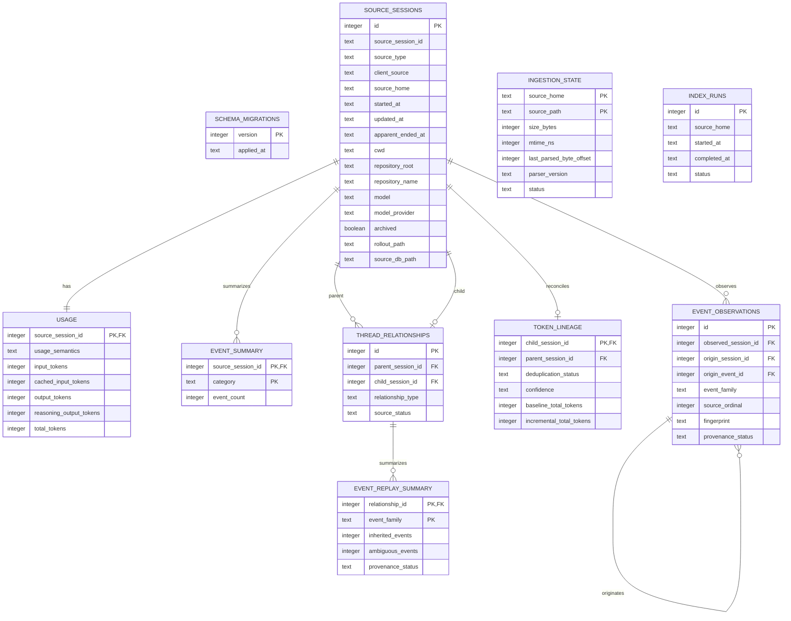

# Normalized database schema

Codex Insights stores derived analytics in its own SQLite database. This database is never placed
inside the selected Codex home and is the only database Codex Insights may create or migrate.
Codex-owned SQLite files remain read-only sources.

The default path is platform-aware:

- macOS: `~/Library/Application Support/Codex Insights/index.sqlite3`
- Windows: `%LOCALAPPDATA%\Codex Insights\index.sqlite3`
- other platforms: `${XDG_DATA_HOME:-~/.local/share}/codex-insights/index.sqlite3`

Every database-using CLI command accepts `--db PATH`. Paths equal to or nested under the resolved
Codex home are rejected before SQLite is opened.

## Entity relationships

## Table contracts

`source_sessions` is the stable catalogue. Its natural identity is the tuple of adapter source
type, resolved Codex home, and source session ID. The internal integer key is used only for local
relationships. Source paths and adapter provenance remain available so rows can be refreshed or
diagnosed without retaining raw rollout records.

`source_type` identifies the adapter, currently `codex-local`. Schema version 2 adds
`client_source` for the catalogue's user-meaningful origin such as CLI or editor. Keeping these
separate makes source filtering useful without confusing an unstable source value with adapter
provenance.

`usage` contains one observed aggregate row per session. `usage_semantics` distinguishes a source-reported
`cumulative_total` from `summed_event_deltas`; `unavailable` means no trustworthy token record was
observed. Schema version 3 makes each token metric nullable so an absent field remains different
from a source-reported zero. The schema also includes cache-write input tokens because the source
audit observed that field.

`thread_relationships` normalizes explicit source spawn edges. Source IDs are retained so orphan
references can be audited; nullable internal IDs link valid endpoints to `source_sessions`.
Parenthood is never inferred from model names.

`token_lineage` stores only content-free accounting evidence for child threads: status,
confidence, exact matched-snapshot count, inherited baseline vector, child-exclusive incremental
vector, and whether `last_token_usage` corroborates the cumulative difference. It does not store
messages, raw rollout lines, or tool output. `accounted_usage` is a view that preserves the
observed `usage` vector while exposing a lineage-adjusted aggregate contribution.

`event_summary` stores counts keyed by normalized categories. It does not store event payloads,
message bodies, command arguments, patches, stdout, stderr, environment dumps, or hidden reasoning.

`event_observations` stores selected semantic record fingerprints, order, family, and conservative
origin mappings. `event_replay_summary` aggregates the evidence per explicit parent-child edge and
event family. Neither table stores raw event bodies. A fingerprint is combined with explicit
lineage and sequence evidence; it is never treated as provenance proof on its own. See
`docs/event-provenance.md` for exact and ambiguous semantics.

`ingestion_state` records inexpensive file identity metadata, parser/schema versions, status, and
the last safe byte offset. Size and nanosecond mtime are the initial incremental-change signal;
content hashes are intentionally omitted until evidence shows they are needed.

`index_runs` records aggregate run outcomes so `db-info` can report the latest completed indexing
time. `schema_migrations` records forward-only migrations for this derived database.

## Time and deletion policy

Normalized timestamps are stored as ISO 8601 UTC text. When the source supplies an explicit offset,
its offset in minutes can be preserved on the session for later local-time rendering. The index is
derived and rebuildable; migrations and deletion policy apply only to this database, never to Codex
source state.

## Incremental upsert behavior

`codex-insights index` creates an `index_runs` row, discovers normalized catalogue candidates
through the adapter, and processes each session in its own transaction. A malformed JSONL line is
counted as a structural warning and does not abort its session; an unrecoverable error rolls back
only that session and increments the run's failed count.

Size plus nanosecond mtime is the initial file-change signal. Parser-version and recognized
source-schema-version changes also force a reparse. Unchanged files retain their usage and event
rows byte-for-byte unless catalogue metadata changed. Reparsed sessions replace their one usage
row, category counts, and compact semantic observations transactionally, so rerunning the index
cannot create duplicates.

After session upserts, the adapter discovers explicit thread relationships. Lineage is recomputed
only for new relationships, changed endpoints, an algorithm-version change, or missing lineage.
An unchanged second index leaves relationship and lineage rows byte-for-byte stable.

The six reported outcomes are session-candidate outcomes. A new metadata-only catalogue row whose
rollout is missing is stored for provenance but reported as `skipped`, not `new`; consequently the
database can contain more session catalogue rows than the `new` count from a first run.

## History query semantics

History commands read only these normalized tables. Session lists are ordered by start time
descending and then full source session ID, producing deterministic results when timestamps tie.
`since` boundaries are inclusive and timestamp `until` boundaries are exclusive. A date-only
`until` is converted to midnight of the following day so the named calendar day is included.

Rows whose usage semantics are `unavailable` return null token values through the query layer.
Repository aggregation groups null repository roots into `Outside Git repositories`, while the
repository count in `stats` counts only resolved Git roots.

`session SESSION_ID` and session-list token columns continue to show the rollout's observed
cumulative total. Additive totals in `stats`, `repos`, `models`, and `usage` use the contribution
from `accounted_usage`.

## Usage analytics semantics

`analytics/usage.py` sums non-null lineage-adjusted contributions and reports field-level session
coverage alongside every aggregate. Exact inherited baselines and replayed cumulative prefixes
are subtracted once. Ambiguous, cyclic, or otherwise unsupported cases retain their observed
rollout contribution and remain explicit in reconciliation diagnostics; no guessed baseline is
subtracted. Missing usage remains null rather than becoming zero.

Mean, median, and nearest-rank p90 tokens/session remain distributions of observed per-rollout
totals. They are not additive account totals and are labelled as observed in terminal output.

Repository grouping uses `repository_root` as its identity and `repository_name` as its display
label. Model grouping uses the normalized model/provider pair. Day and Monday-starting week groups
convert UTC session timestamps into the requested local or IANA timezone before assigning buckets.
Sessions/day uses the selected calendar window; with no time filter it uses the inclusive span from
the first to latest matching activity date.

Incremental child usage is attributed to the child's own start time, normalized repository, and
model. A parent outside a selected time window does not reintroduce its historical baseline into
that window. Local rollout telemetry is not guaranteed to equal OpenAI billing, quota, or other
server-side accounting, and Codex Insights does not claim to reproduce a private accounting
algorithm.
