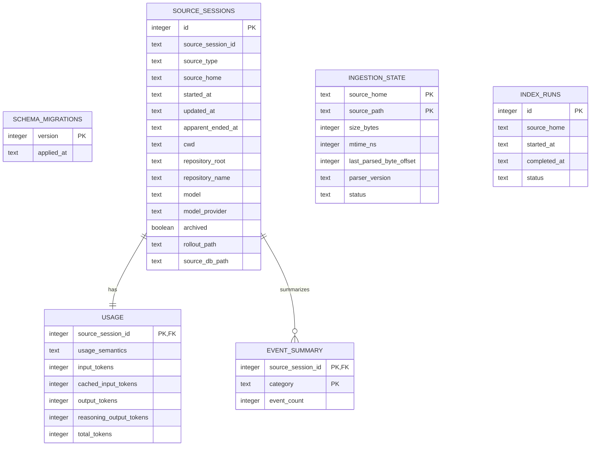

# Normalized database schema

Codex Insights stores derived analytics in its own SQLite database. This database is never placed
inside the selected Codex home and is the only database Codex Insights may create or migrate.
Codex-owned SQLite files remain read-only sources.

The default path is platform-aware:

- macOS: `~/Library/Application Support/Codex Insights/index.sqlite3`
- Windows: `%LOCALAPPDATA%\Codex Insights\index.sqlite3`
- other platforms: `${XDG_DATA_HOME:-~/.local/share}/codex-insights/index.sqlite3`

Every database-using CLI command accepts `--db PATH`. Paths equal to or nested under the resolved
Codex home are rejected before SQLite is opened.

## Entity relationships

## Table contracts

`source_sessions` is the stable catalogue. Its natural identity is the tuple of adapter source
type, resolved Codex home, and source session ID. The internal integer key is used only for local
relationships. Source paths and adapter provenance remain available so rows can be refreshed or
diagnosed without retaining raw rollout records.

`usage` contains one aggregate row per session. `usage_semantics` distinguishes a source-reported
`cumulative_total` from `summed_event_deltas`; `unavailable` means no trustworthy token record was
observed. A zero value therefore does not by itself claim that the source reported zero tokens.
The schema also includes cache-write input tokens because the source audit observed that field.

`event_summary` stores counts keyed by normalized categories. It does not store event payloads,
message bodies, command arguments, patches, stdout, stderr, environment dumps, or hidden reasoning.

`ingestion_state` records inexpensive file identity metadata, parser/schema versions, status, and
the last safe byte offset. Size and nanosecond mtime are the initial incremental-change signal;
content hashes are intentionally omitted until evidence shows they are needed.

`index_runs` records aggregate run outcomes so `db-info` can report the latest completed indexing
time. `schema_migrations` records forward-only migrations for this derived database.

## Time and deletion policy

Normalized timestamps are stored as ISO 8601 UTC text. When the source supplies an explicit offset,
its offset in minutes can be preserved on the session for later local-time rendering. The index is
derived and rebuildable; migrations and deletion policy apply only to this database, never to Codex
source state.
